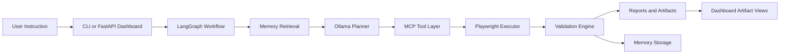
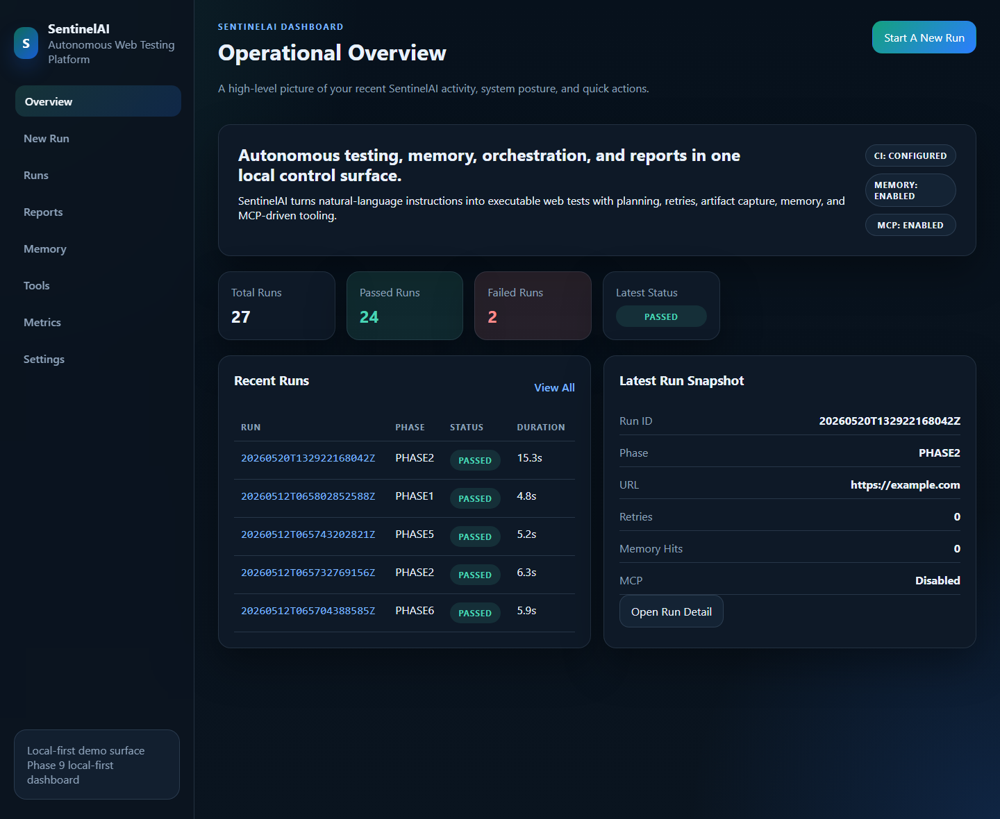
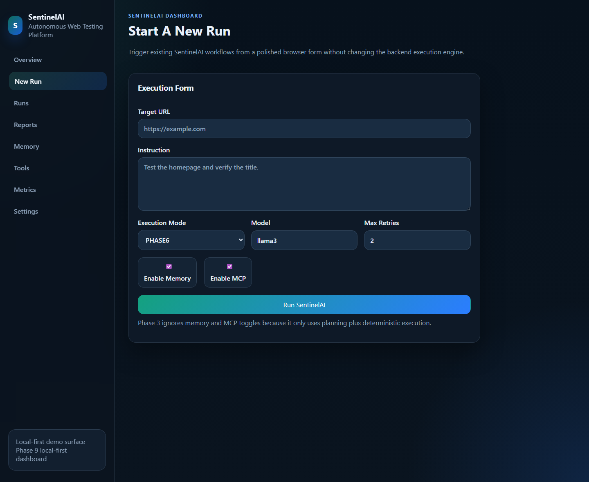
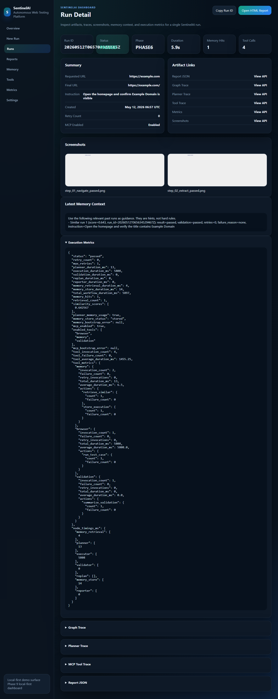
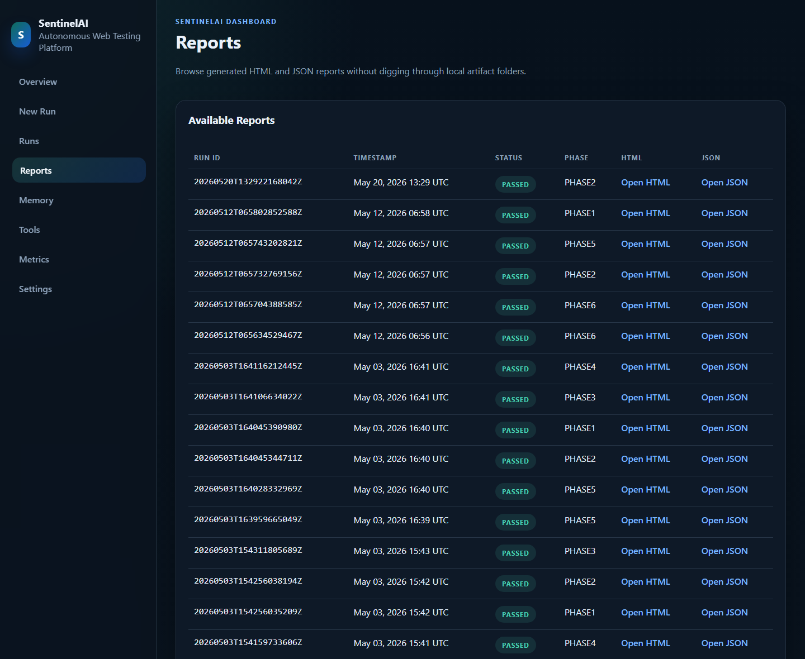
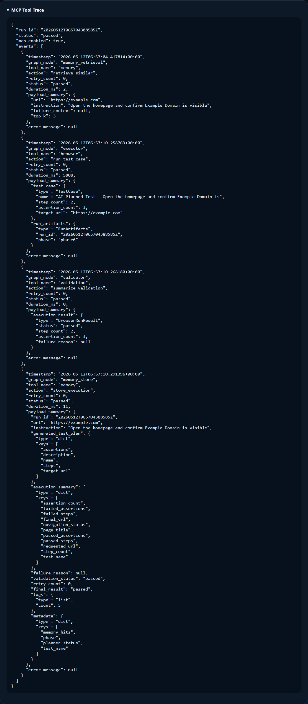

# SentinelAI
[](https://github.com/nexusBL/SentinelAI/actions/workflows/ci.yml)

SentinelAI is a production-style autonomous web testing platform that turns natural-language instructions into executable browser tests, validates outcomes, stores memory from prior runs, and exposes the whole system through both a CLI and a polished FastAPI dashboard.

This project is designed to showcase advanced AI systems engineering, full-stack architecture, and product-minded developer tooling in one repository. It combines local LLM planning, graph-based orchestration, browser automation, persistent vector memory, MCP-style tools, observability, CI quality gates, and a demo-friendly UI.

## Why SentinelAI Exists

Traditional end-to-end test automation often depends on brittle hand-authored scripts that become expensive to maintain as products evolve. SentinelAI explores a different approach:

- accept a URL and natural-language instruction
- plan test steps automatically with a local LLM
- execute and validate those steps through a reusable workflow
- learn from prior runs using persistent memory
- expose artifacts, traces, and metrics through a product-style dashboard

The result is a strong portfolio project for AI systems, platform engineering, automation, and product-facing developer experience.

## Key Features

- Playwright-based browser automation with screenshots and DOM capture
- deterministic JSON test execution and rule-based validation
- Ollama-powered planning with strict JSON output enforcement
- LangGraph orchestration with retry and replan logic
- persistent FAISS memory with retrieval-augmented planning
- MCP-style browser, memory, and validation tool servers
- JSON, HTML, graph trace, planner trace, tool trace, and metrics artifacts
- FastAPI dashboard with multi-page artifact browsing and run execution
- pytest suite, smoke test, local dev gate, and GitHub Actions CI

## Architecture



SentinelAI keeps these layers loosely coupled:

- `dashboard/` is optional and sits on top of the existing runtime
- `agents/` owns planning and orchestration wrappers, not low-level browser code
- `browser/` handles execution primitives and runtime models
- `validation/` stays deterministic and independent from the planner
- `memory/` is modular and replaceable behind `MemoryManager`
- `mcp_servers/` exposes system capabilities through standardized tool interfaces

More detail lives in [docs/ARCHITECTURE.md](docs/ARCHITECTURE.md).

## Feature Matrix

| Phase | Feature | Status |
|---|---|---|
| Phase 1 | Playwright automation, screenshots, DOM capture, artifacts, reports | Complete |
| Phase 2 | Structured test execution and validation engine | Complete |
| Phase 3 | Ollama-based AI planner | Complete |
| Phase 4 | LangGraph orchestration with retry and replan flow | Complete |
| Phase 5 | Persistent FAISS memory with planner context injection | Complete |
| Phase 6 | MCP-style browser, memory, and validation tools | Complete |
| Phase 7 | Pytest suite, smoke test, and local quality gate | Complete |
| Phase 8 | GitHub Actions CI pipeline | Complete |
| Phase 9 | Optional FastAPI multi-page dashboard | Complete |
| Phase 10 | Final documentation, demo assets, and GitHub packaging polish | Complete |
| Phase 11 | Real dashboard screenshots and visual showcase assets | Complete |
| Phase 12 | Local production Docker Compose and NGINX deployment foundation | Complete |
| Phase 13 | Async job queue, background worker, and live dashboard polling | Complete |

## Repository Layout

```text
SentinelAI/
|-- ai/                 # Ollama HTTP client
|-- agents/             # Planner and LangGraph orchestration
|-- browser/            # Playwright execution and browser result models
|-- config/             # Environment-driven runtime settings
|-- dashboard/          # Optional FastAPI dashboard, templates, and static assets
|-- docker/             # Production-style Docker Compose, app image, and NGINX config
|-- docs/               # Architecture, demo, troubleshooting, and screenshot placeholders
|-- jobs/               # Lightweight in-process async job queue and worker
|-- mcp_servers/        # MCP-style tool interfaces and registry
|-- memory/             # Embeddings, vector store, and memory manager
|-- reporting/          # Artifact and report generation
|-- sentinelai/         # Shared runtime helpers and test case schema
|-- testcases/          # Example deterministic test cases and templates
|-- tests/              # Unit and integration-style tests
|-- validation/         # Deterministic assertion engine
`-- main.py             # CLI entrypoint for Phases 1 through 6
```

## Quick Start

### 1. Python Setup

```powershell
python -m venv .venv
.venv\Scripts\Activate.ps1
pip install -r requirements.txt
python -m playwright install chromium
```

### 2. Ollama Setup

Ollama runs outside the Python environment as a local service.

```bash
ollama serve
ollama pull llama3
```

Default endpoint:

```text
http://localhost:11434/api/generate
```

Configuration defaults and overrides are documented in [.env.example](.env.example).

## CLI Commands

```bash
python main.py phase1 --url https://example.com
python main.py phase2 --test testcases/sample_test.json
python main.py phase3 --url https://example.com --instruction "test homepage"
python main.py phase4 --url https://example.com --instruction "test homepage"
python main.py phase5 --url https://example.com --instruction "test homepage"
python main.py phase6 --url https://example.com --instruction "test homepage"
uvicorn dashboard.app:app --reload
python -m pytest
python scripts/dev_check.py
```

Recommended Phase 6 example:

```bash
python main.py phase6 --url https://example.com --instruction "Open the homepage, confirm the title, and validate the main heading."
```

## Dashboard

Phase 9 adds an optional local-first dashboard built with:

- FastAPI
- Jinja2 templates
- custom HTML and CSS
- vanilla JavaScript

Run it locally:

```bash
uvicorn dashboard.app:app --reload
```

Open:

- `http://127.0.0.1:8000/`
- `http://127.0.0.1:8000/new-run`
- `http://127.0.0.1:8000/runs`
- `http://127.0.0.1:8000/reports`
- `http://127.0.0.1:8000/memory`
- `http://127.0.0.1:8000/tools`
- `http://127.0.0.1:8000/metrics`
- `http://127.0.0.1:8000/settings`

The dashboard remains optional. The CLI is still the primary backend interface, and no Streamlit is used.

Phase 13 makes dashboard execution asynchronous. New Run submissions create a background job immediately, redirect to `/jobs/<job_id>`, and poll the local API until a final `run_id` is available.

## Demo Flow

This is the fastest showcase path for GitHub visitors or interview demos:

1. Start Ollama:

```bash
ollama serve
```

2. Pull the default model:

```bash
ollama pull llama3
```

3. Run a Phase 6 CLI workflow:

```bash
python main.py phase6 --url https://example.com --instruction "Test the homepage and validate the title."
```

4. Launch the dashboard:

```bash
uvicorn dashboard.app:app --reload
```

5. Open the browser UI at `http://127.0.0.1:8000/new-run` and submit a Phase 6 run.

6. Open the generated run detail page to inspect screenshots, report links, graph trace, planner trace, metrics, and failure or pass state.

7. Open the Reports page to browse HTML and JSON reports.

8. Open the Memory and Tools pages to show retrieval hits, stored memory behavior, MCP tool traces, and metrics.

There is a longer presenter-oriented script in [docs/DEMO.md](docs/DEMO.md).

## Sample Test Cases

The repository ships with safe, generic examples:

- [testcases/sample_test.json](testcases/sample_test.json): passing example against `example.com`
- [testcases/failing_sample_test.json](testcases/failing_sample_test.json): intentionally failing case for demoing negative paths
- [testcases/login_flow_template.json](testcases/login_flow_template.json): placeholder login workflow template with non-secret example selectors and values

## Artifacts Generated

SentinelAI writes run artifacts under `artifacts/runs/<run_id>/`.

Common outputs include:

- `reports/report.json`
- `reports/report.html`
- `graph/graph_trace.json`
- `graph/tool_trace.json`
- `planner/planner_trace.json`
- `metrics/execution_metrics.json`
- `screenshots/*.png`
- `logs/page_dom.html`
- planner raw response and normalized test plan files

Persistent memory is stored separately under `memory_store/` by default.

## Testing and Quality Gates

Local verification:

```bash
python -m compileall .
python -m pytest
python scripts/smoke_test.py
python scripts/dev_check.py
```

What the quality system covers:

- settings and environment overrides
- testcase schema validation
- deterministic assertions
- planner retries and schema enforcement
- memory persistence and retrieval
- MCP registry and tool-server behavior
- LangGraph workflow success and retry paths
- reporting and artifact writing
- dashboard route and utility safety
- async job lifecycle and dashboard polling APIs
- backward compatibility of the CLI

GitHub Actions runs the same core checks on `push` and `pull_request` to `main`.

## Docker

Phase 12 adds a local production-style Docker Compose stack:

```powershell
docker compose -f docker/docker-compose.yml up --build
```

Open the dashboard through NGINX:

```text
http://127.0.0.1:8000
```

Health check:

```powershell
curl http://127.0.0.1:8000/health
```

Stop the stack:

```powershell
docker compose -f docker/docker-compose.yml down
```

The deployment uses:

- `sentinelai-app`: FastAPI served by Gunicorn with one Uvicorn worker while jobs are in-process
- `sentinelai-nginx`: reverse proxy on localhost port `8000`
- `sentinelai_artifacts`: persistent Docker volume for reports and screenshots
- `sentinelai_memory_store`: persistent Docker volume for FAISS memory
- `requirements-docker.txt`: slimmer deployment dependency profile using hashing embeddings
- official Playwright Python runtime image for browser-ready container execution

For LLM-backed flows inside Docker, run Ollama on the host and use the compose default endpoint `http://host.docker.internal:11434/api/generate`.

Full deployment notes are in [docs/DEPLOYMENT.md](docs/DEPLOYMENT.md).

## Screenshots

These screenshots were captured locally against safe `example.com` demo data and SentinelAI artifact pages.











Additional dashboard screenshots are stored in [docs/screenshots](docs/screenshots/README.md):

- runs page
- memory page
- tools page
- metrics page
- settings page

## Advanced Aspects That Make This Project Stand Out

- local LLM planning with strict JSON plan validation
- graph-based orchestration rather than a linear script runner
- persistent vector memory with retrieval-augmented planning
- MCP-style tool abstraction for browser, memory, and validation capabilities
- product-style dashboard layered cleanly over the CLI/runtime
- offline-friendly tests, smoke checks, and GitHub CI
- modular architecture designed for future hosted UI, additional tools, or cloud execution

## Additional Docs

- [docs/ARCHITECTURE.md](docs/ARCHITECTURE.md)
- [docs/DEMO.md](docs/DEMO.md)
- [docs/DEPLOYMENT.md](docs/DEPLOYMENT.md)
- [docs/JOBS.md](docs/JOBS.md)
- [docs/TROUBLESHOOTING.md](docs/TROUBLESHOOTING.md)

## License / Usage

This repository is structured as a portfolio-quality engineering project and local experimentation environment. Review the code, adapt the templates, and extend the architecture to match your own product or testing workflows.
