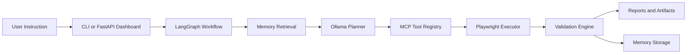

# SentinelAI Architecture

## Overview

SentinelAI is structured as a modular AI testing platform rather than a single-script automation tool. Each subsystem has a narrow responsibility and clean interface so future features can be added without rewriting the whole stack.

Core properties:

- local-first runtime
- loosely coupled modules
- deterministic validation path
- optional AI planning and dashboard layers
- persistent memory across runs
- artifact-first observability
- testable, CI-friendly packaging

## High-Level Flow



## Module Responsibilities

| Module | Responsibility |
|---|---|
| `main.py` | CLI entrypoint for Phases 1 through 6 |
| `config/` | Environment-driven runtime configuration |
| `browser/` | Playwright execution, screenshots, DOM capture, browser result models |
| `validation/` | Deterministic assertions and pass/fail reasoning |
| `ai/` | Ollama HTTP client |
| `agents/planner_agent.py` | Natural-language to structured test-plan conversion |
| `agents/graph_workflow.py` | LangGraph orchestration, retries, observability, memory integration |
| `memory/` | Embeddings, FAISS vector storage, retrieval, and memory persistence |
| `mcp_servers/` | MCP-style tool servers and registry abstraction |
| `reporting/` | JSON/HTML report generation and artifact management |
| `dashboard/` | Optional FastAPI UI for runs, reports, traces, memory, tools, and metrics |
| `tests/` | Offline-friendly quality and regression protection |

## Data Flow

1. A user triggers SentinelAI from the CLI or dashboard.
2. The LangGraph workflow initializes run context and artifacts.
3. If memory is enabled, similar prior runs are retrieved from FAISS.
4. The planner calls Ollama and produces a strict JSON test plan.
5. The executor runs the plan through Playwright, either directly or via MCP.
6. The validation layer checks assertions and extracts failure reasons.
7. Retry and replan logic may loop through the planner again.
8. Reports, traces, screenshots, and metrics are written to artifacts.
9. If enabled, summarized run data is stored back into persistent memory.

## Artifact Flow

Per-run output goes under:

```text
artifacts/runs/<run_id>/
```

Key folders:

- `reports/`: `report.json`, `report.html`
- `graph/`: `graph_trace.json`, `tool_trace.json`
- `planner/`: planner attempts, normalized plan, retrieval artifacts
- `metrics/`: `execution_metrics.json`
- `screenshots/`: before/after and per-step screenshots
- `logs/`: DOM snapshots and memory store artifacts

Persistent cross-run memory is stored separately under:

```text
memory_store/
```

## Extension Points

SentinelAI is intentionally designed for future extension:

- swap the embedding provider without changing planner or executor code
- replace FAISS with ChromaDB or a managed vector store behind the memory interface
- add new MCP servers for filesystem, API, or cloud capabilities
- extend LangGraph nodes without rewriting existing execution logic
- replace the dashboard with a hosted frontend later while keeping backend APIs intact
- add integration-test tiers or deployment workflows without disturbing unit-test safety

## Why The Architecture Matters

This project is not just a web automation demo. It demonstrates:

- AI orchestration with deterministic guardrails
- memory-augmented planning
- modular tool abstraction
- traceable artifact pipelines
- product-grade developer experience
- CI-backed reliability for a multi-layer AI system
