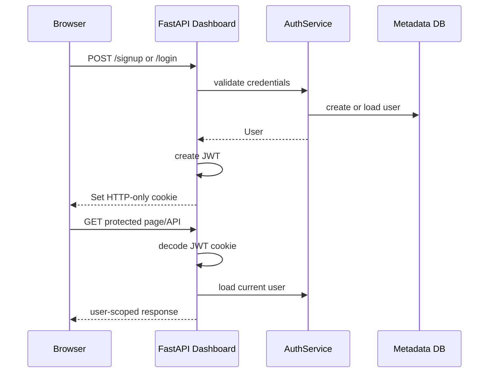

# SentinelAI Authentication Foundation

Phase 14 adds a lightweight authentication and ownership layer around the existing SentinelAI runtime. It is intentionally local-first and educational: the goal is to demonstrate production-style auth fundamentals without adding OAuth, external identity providers, Redis, or PostgreSQL yet.

## What It Adds

- Local signup and login pages in the FastAPI dashboard
- Password hashing with `bcrypt`
- JWT access tokens stored in an HTTP-only browser cookie
- SQLAlchemy-backed user persistence in the metadata database
- User ownership for dashboard-submitted jobs
- Owner metadata for runs generated by authenticated dashboard jobs
- Protected dashboard pages and APIs
- Simple roles: `admin` and `user`

The first created user becomes an `admin`. Later signups become normal `user` accounts.

## Auth Flow



## Storage

As of Phase 15, users are stored in the central metadata database:

```text
metadata_store/sentinelai_metadata.db
```

The path is configurable:

```text
SENTINELAI_DATABASE_SQLITE_PATH=metadata_store/sentinelai_metadata.db
```

Docker Compose persists this path through a named volume mounted at:

```text
/app/metadata_store
```

`SENTINELAI_AUTH_SQLITE_PATH` may still appear in older local configuration files for Phase 14 compatibility, but new user persistence is handled by the metadata database.

## Password Security

SentinelAI never stores plain-text passwords. Signup hashes passwords with `bcrypt`, and login verifies the submitted password against the stored hash.

Minimum password length is currently 8 characters. This is intentionally simple for a local learning project and can be expanded later with password strength checks.

## JWT Cookie Sessions

After login or signup, SentinelAI creates a signed JWT containing:

- `sub`: user ID
- `role`: user role
- `iat`: issued-at timestamp
- `exp`: expiration timestamp

The token is stored in an HTTP-only cookie:

```text
SENTINELAI_AUTH_COOKIE_NAME=sentinelai_session
```

Logout is implemented as token discard: the dashboard deletes the browser cookie. There is no server-side token blacklist yet.

For local HTTP development:

```text
SENTINELAI_AUTH_SECURE_COOKIE=false
```

When serving over HTTPS in a real deployment, set:

```text
SENTINELAI_AUTH_SECURE_COOKIE=true
```

## Route Protection

Unauthenticated users can access:

- `/login`
- `/signup`
- `/logout`
- `/health`

Protected dashboard pages redirect to `/login`:

- `/`
- `/new-run`
- `/runs`
- `/reports`
- `/memory`
- `/tools`
- `/metrics`
- `/settings`
- `/jobs/{job_id}`
- `/runs/{run_id}`

Protected APIs return `401` JSON errors when unauthenticated.

## Ownership Model

Dashboard-created jobs store:

```text
owner_user_id
```

When a job completes and produces a run, SentinelAI writes:

```text
artifacts/runs/<run_id>/metadata/owner.json
```

Normal users only see runs and jobs matching their own `user_id`.

Admins can see all jobs and runs. This keeps old CLI-generated artifacts inspectable by the first local user while still teaching user isolation.

## Configuration

Common auth settings:

```text
SENTINELAI_AUTH_ENABLED=true
SENTINELAI_AUTH_JWT_SECRET=change-this-local-development-secret-32-plus-bytes
SENTINELAI_AUTH_TOKEN_EXPIRE_MINUTES=1440
SENTINELAI_AUTH_COOKIE_NAME=sentinelai_session
SENTINELAI_AUTH_SECURE_COOKIE=false
SENTINELAI_DATABASE_SQLITE_PATH=metadata_store/sentinelai_metadata.db
```

Use a unique, long `SENTINELAI_AUTH_JWT_SECRET` for any shared environment.

## Future Upgrade Path

The current implementation is intentionally small and replaceable. Future production upgrades can add:

- PostgreSQL user storage
- server-side sessions or token revocation
- refresh tokens
- CSRF protection for browser forms
- OAuth providers
- richer RBAC
- audit logs
- organization/team ownership

Those upgrades should wrap the same ownership boundaries instead of rewriting the workflow engine.
