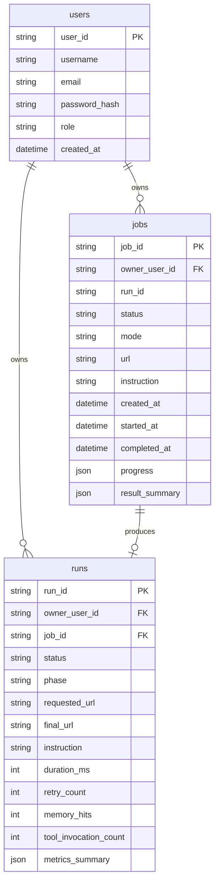

# SentinelAI Metadata Database

Phase 15 adds a central SQLAlchemy metadata database while keeping reports, screenshots, DOM snapshots, traces, and large artifacts on disk.

The database is an index and state layer. The filesystem remains the artifact layer.

## Why This Exists

Before Phase 15, SentinelAI discovered most state by scanning:

```text
artifacts/runs/<run_id>/
```

That works for a local demo, but production-style systems need structured metadata for:

- users
- jobs
- run ownership
- lifecycle state
- filtering
- metrics
- future admin views
- future PostgreSQL migration

## Current Database

SQLite is used first:

```text
metadata_store/sentinelai_metadata.db
```

Configuration:

```text
SENTINELAI_DATABASE_SQLITE_PATH=metadata_store/sentinelai_metadata.db
# Optional full override:
# SENTINELAI_DATABASE_URL=sqlite:///metadata_store/sentinelai_metadata.db
```

Docker persists this database in:

```text
/app/metadata_store
```

## Schema



## Persistence Flow

1. Signup creates a `users` row.
2. Dashboard run submission creates a `jobs` row with status `queued`.
3. The background worker updates the job to `running`.
4. Completion updates the job to `completed` or `failed`.
5. If a run was produced, SentinelAI upserts a `runs` row.
6. Dashboard run listing reads metadata from the database.
7. Run detail pages still load artifact files from `artifacts/runs/<run_id>/`.

## Legacy Artifact Sync

Legacy filesystem runs remain supported.

When dashboard utilities list runs, they scan existing artifact directories and upsert metadata into the database. This makes older runs visible without requiring a migration script that rewrites artifacts.

Admins can see all synced legacy runs. Normal users only see runs owned by their user ID.

## Alembic

Alembic tracks database schema migrations.

Run migrations:

```bash
alembic upgrade head
```

Create a future migration:

```bash
alembic revision --autogenerate -m "describe change"
```

Current initial migration:

```text
alembic/versions/20260604_0001_initial_metadata.py
```

## Developer Notes

Runtime code uses:

- `database/base.py`: shared SQLAlchemy declarative base
- `database/models.py`: ORM models
- `database/session.py`: engine/session/initialization helpers
- `database/repositories.py`: repository abstraction used by auth, jobs, and dashboard utilities

Raw SQLAlchemy queries should stay inside repository/service layers rather than spreading into routes.

## Future PostgreSQL Path

The repository and SQLAlchemy URL design make PostgreSQL a natural later step:

1. Add a PostgreSQL service in Docker Compose.
2. Set `SENTINELAI_DATABASE_URL=postgresql+psycopg://...`.
3. Run `alembic upgrade head`.
4. Move job queue state from in-process memory to database or Redis.

Artifacts can still remain on filesystem or move later to object storage.
