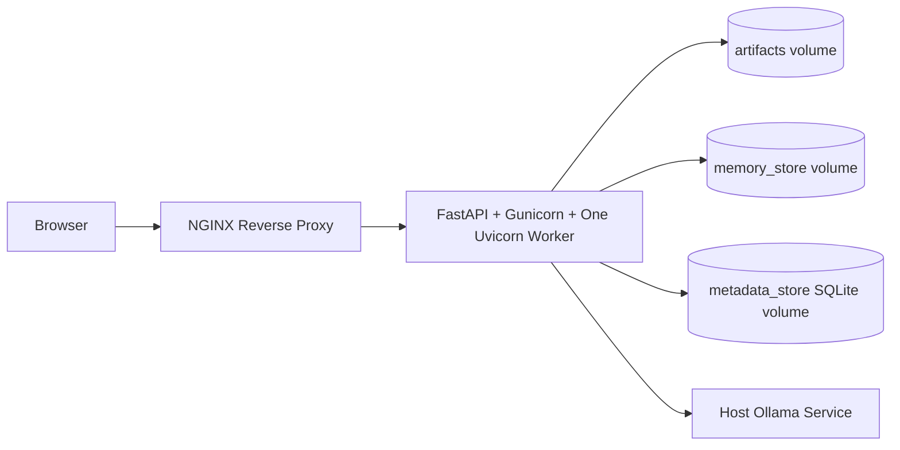

# SentinelAI Local Production Deployment

This guide explains the Phase 12 deployment foundation. It runs SentinelAI locally with a production-style shape while staying beginner-friendly and laptop-safe.

## Architecture



The Docker stack contains:

| Service | Purpose |
|---|---|
| `sentinelai-app` | FastAPI dashboard/backend served by Gunicorn with one Uvicorn worker |
| `sentinelai-nginx` | Reverse proxy that exposes the app at `http://127.0.0.1:8000` |
| `sentinelai_artifacts` | Named Docker volume for run reports, screenshots, traces, and metrics |
| `sentinelai_memory_store` | Named Docker volume for FAISS memory data |
| `sentinelai_metadata_store` | Named Docker volume for SQLAlchemy metadata |

## Prerequisites

You already verified Docker is installed:

```powershell
docker --version
docker compose version
```

For AI-backed Phase 3 through Phase 6 runs, install Ollama on the host and start it separately:

```bash
ollama serve
ollama pull llama3
```

The compose stack points to host Ollama with:

```text
http://host.docker.internal:11434/api/generate
```

## Start The Stack

From the repository root:

```powershell
docker compose -f docker/docker-compose.yml up --build
```

Open:

```text
http://127.0.0.1:8000
```

Health check:

```powershell
curl http://127.0.0.1:8000/health
```

Expected response:

```json
{"status":"ok"}
```

## Stop The Stack

```powershell
docker compose -f docker/docker-compose.yml down
```

To remove persistent named volumes as well:

```powershell
docker compose -f docker/docker-compose.yml down -v
```

## Logs

Follow all service logs:

```powershell
docker compose -f docker/docker-compose.yml logs -f
```

App logs only:

```powershell
docker compose -f docker/docker-compose.yml logs -f app
```

NGINX logs only:

```powershell
docker compose -f docker/docker-compose.yml logs -f nginx
```

## Persistent Storage

The app writes generated data into Docker named volumes:

- `/app/artifacts` stores `artifacts/runs/<run_id>/`
- `/app/memory_store` stores FAISS memory data
- `/app/metadata_store` stores the SQLite metadata database, including users/jobs/runs

These volumes survive container restarts and rebuilds. They are intentionally separate from the source tree so deployment runs do not dirty the Git worktree.

Phase 13 uses an in-process job queue, so the Docker app intentionally runs one Gunicorn worker. A future Redis or Celery-backed queue can safely scale this horizontally.

## Environment Configuration

Most runtime settings come from environment variables. Important deployment values:

| Variable | Default In Compose | Purpose |
|---|---|---|
| `SENTINELAI_ARTIFACTS_DIR` | `/app/artifacts` | Run artifact storage |
| `SENTINELAI_MEMORY_VECTOR_DB_PATH` | `/app/memory_store` | Persistent memory path |
| `SENTINELAI_DATABASE_SQLITE_PATH` | `/app/metadata_store/sentinelai_metadata.db` | SQLAlchemy metadata database |
| `SENTINELAI_AUTH_JWT_SECRET` | local demo secret | JWT signing secret; change this for shared environments |
| `SENTINELAI_OLLAMA_ENDPOINT` | `http://host.docker.internal:11434/api/generate` | Host Ollama API |
| `SENTINELAI_BROWSER_HEADLESS` | `true` | Headless browser automation |
| `SENTINELAI_MCP_ENABLED` | `true` | MCP tool layer |

See [.env.example](../.env.example) for the broader runtime settings.

## Dependency Profile

The Docker image installs from `requirements-docker.txt`, which is intentionally smaller than the local development `requirements.txt`.

The app image uses the official Playwright Python runtime image so Chromium and its OS libraries are already present. The deployment profile uses the default hashing embedding provider, so it does not install the optional `sentence-transformers` stack. Local development keeps the full dependency file for experimentation.

The container starts as root only long enough to prepare the mounted artifact, memory, and metadata volumes, then the entrypoint launches Gunicorn as the non-root `pwuser` user.

## Authentication Notes

The Docker dashboard uses the same local signup/login flow as development mode. Open `http://127.0.0.1:8000`, create the first account, and that first user becomes an admin.

Auth data persists in the `sentinelai_metadata_store` named volume. To reset local Docker users completely:

```powershell
docker compose -f docker/docker-compose.yml down -v
```

For real shared deployments, replace `SENTINELAI_AUTH_JWT_SECRET` in `docker/docker-compose.yml` with a unique long secret and serve the dashboard over HTTPS before setting `SENTINELAI_AUTH_SECURE_COOKIE=true`.

## Metadata Database

Phase 15 persists users, jobs, runs, ownership, and lifecycle state through SQLAlchemy. Artifacts still live under `/app/artifacts`.

The app initializes the SQLite metadata database automatically on startup. Alembic migrations are available for explicit schema upgrades:

```powershell
docker compose -f docker/docker-compose.yml exec app alembic upgrade head
```

Metadata persists in the `sentinelai_metadata_store` named volume.

## Troubleshooting

### Dashboard Does Not Open

Check container status:

```powershell
docker compose -f docker/docker-compose.yml ps
```

Then inspect logs:

```powershell
docker compose -f docker/docker-compose.yml logs app nginx
```

### Port 8000 Is Already In Use

Stop the local development dashboard or change the NGINX port mapping in `docker/docker-compose.yml`:

```yaml
ports:
  - "8080:80"
```

Then open `http://127.0.0.1:8080`.

### Ollama Connection Fails

Make sure Ollama is running on the host:

```bash
ollama serve
```

For local Python usage, `localhost` is correct. For Docker Compose, use `host.docker.internal`.

### Browser Automation Fails In Docker

The image installs Playwright Chromium and system dependencies during build. Rebuild the image if Playwright dependencies were interrupted:

```powershell
docker compose -f docker/docker-compose.yml build --no-cache app
```

### Memory Looks Empty

The memory volume starts empty. Run a Phase 5 or Phase 6 workflow from the dashboard, then refresh the Memory page.
