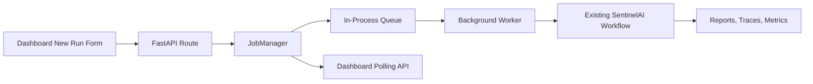

# SentinelAI Async Job System

Phase 13 adds a lightweight local job system around the existing SentinelAI workflow. It does not replace LangGraph, the planner, Playwright, memory, MCP tools, or reporting. It simply changes how dashboard requests trigger work.

## Why Jobs Exist

Before Phase 13, dashboard submissions waited until the full workflow completed. That is simple, but long browser or LLM runs should not block an HTTP request.

Now the dashboard creates a job immediately, returns a job status page, and lets a background worker execute the workflow.

## Lifecycle States

| State | Meaning |
|---|---|
| `queued` | The request has been accepted and is waiting for the worker |
| `running` | The worker is executing the SentinelAI workflow |
| `completed` | The workflow completed successfully and has a run ID |
| `failed` | The workflow raised an error or returned failed status |
| `cancelled` | The job was cancelled before execution, or cancellation was requested |

Each job tracks the request, timestamps, progress metadata, failure reason, and final `run_id` when available.

## Architecture

## Current Worker Model

The current worker is intentionally small:

- in-process
- one sequential worker
- no Redis
- no Celery
- no external broker

Multiple jobs can be queued, and the worker processes them one at a time.

## Dashboard Flow

1. Open `/new-run`.
2. Submit a Phase 3, Phase 4, Phase 5, or Phase 6 run.
3. The dashboard redirects to `/jobs/<job_id>`.
4. The job page polls `/api/jobs/<job_id>`.
5. When execution finishes, the job links to `/runs/<run_id>`.

The Runs page also shows queued and running jobs above historical artifact-backed runs.

## API Endpoints

| Endpoint | Purpose |
|---|---|
| `POST /api/jobs` | Create a job from JSON |
| `GET /api/jobs` | List known jobs |
| `GET /api/jobs/active` | List queued and running jobs |
| `GET /api/jobs/{job_id}` | Get one job status |
| `POST /api/jobs/{job_id}/cancel` | Request cancellation |
| `GET /api/jobs/metrics` | Queue and lifecycle metrics |

Cancellation is best effort. Queued jobs can be cancelled before execution. Running jobs receive a cancellation request, but the current workflow is allowed to finish because the underlying browser and graph execution are not yet interruptible.

## Metrics

The job manager exposes total jobs, queued jobs, running jobs, completed jobs, failed jobs, cancelled jobs, queue length, average execution time, and worker running state.

The dashboard Metrics page displays these alongside workflow metrics.

## Future Upgrade Path

The Phase 12 Docker deployment runs Gunicorn with one Uvicorn worker while the queue is in-process. That keeps job creation and polling consistent. Each process would otherwise have its own job manager, which is why horizontal scaling waits for Redis or a database-backed queue.

For a future hosted deployment, the upgrade path is:

1. Move job state from memory into a database.
2. Move the queue into Redis.
3. Run one or more external worker processes.
4. Add cancellation tokens to the workflow layer.
5. Add WebSocket or Server-Sent Events for live progress.
